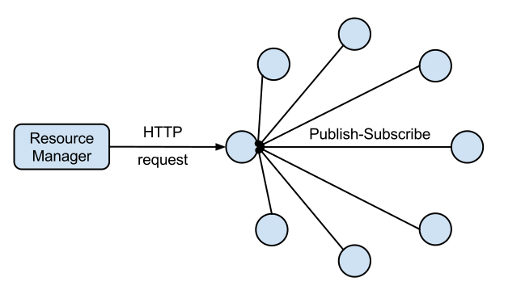
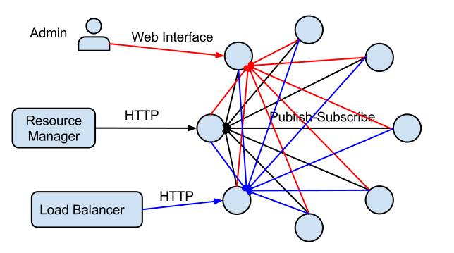
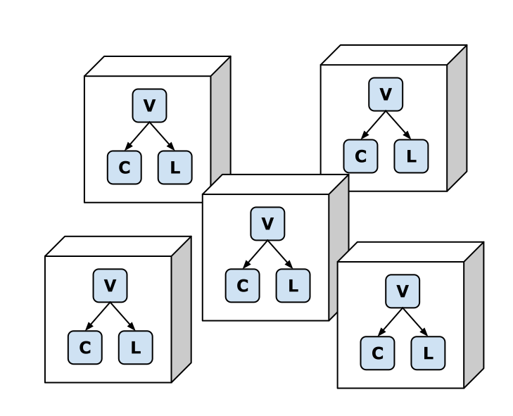
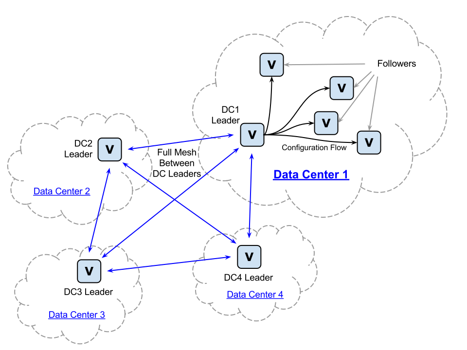

.. role:: frag
   :class: fragment

.. role:: frag-strike
   :class: fragment strike

.. role:: kill
   :class: kill

.. role:: big-arrow
   :class: big-arrow

Orchestration
=============

Agenda
======

* :frag:`What is orchestration?`
* :frag:`What we have built?`
* :frag:`Plans`

Topics
======

* :frag:`Architecture`
* :frag:`Why not docker?`
* :frag:`Why not kubernetes/mesos/...?`
* :frag:`Why rust?`

Orchestration
=============

* :frag:`Auto-Deployment`
* :frag:`Scheduling`
* :frag:`Monitoring`
* :frag:`Self-Healing`

Requirements
============

* :frag:`Minimum components`
* :frag:`Availability first`
* :frag:`Introspection`
* :frag:`Minimum configuration`

Minimum Configuration
=====================

* :frag:`Only One Orchestration`
* :frag:`Security`
* :frag:`Duplication`

Minimum Components
==================

* :frag:`Network Async and Lossy`
* :frag:`Leader Election`

Introspection
=============

.. container:: fragment

    .. class:: fragment fade-in strike

       Logs

       Metrics

.. container:: fragment

    Fine-grained States

Availability First
==================

* :frag:`Restart Process`
* :frag:`Scheduling in Failing Mode`

Requirements
============

* Minimum components
* Availability first
* Introspection
* Minimum configuration

What we have?
=============

* vagga
* lithos
* cantal
* verwalter

Vagga
=====

Containers for dev.env.

Vagga
=====

.. code-block:: console

    $ git clone git@host:proj
    $ cd proj
    $ vagga
    Available commands:
      run   Start app with postgres and redis
      doc   Build docs with sphinx
      test  Run unit tests
      js    Compile javascripts

Example 1 
=========

.. code-block:: console

    $ vagga run
    Okay, server started at http://localhost:8080

Example 2
=========

.. code-block:: console

    $ vagga doc
    Installing sphinx
    ...
    Docs are built in doc/_build/html/index.html

Example 3
=========

.. code-block:: console

    $ git pull
    $ vagga test
    Requirements txt changed
    Rebuilding container "test"
    ................
    Ok 20 successful

Vagga
=====

* Self-documentation
* IDE folders with deps
* Versioning
* Continuous Integration

Lithos
======

Production-grade containers

Lithos
======

* Start process
* Set up environment
* Mount file systems
* Restart on failure

Lithos
======

* :kill:`Downloading`
* :kill:`Build`
* :kill:`Network API`

Lithos
======

Configuration files

.. class:: fragment

   introspection

   security

Lithos: Security
================

* :frag:`Sandbox config`
* :frag:`Read-only/nosuid/noexec`
* :frag:`Fixed command-line (*)`

.. class:: fragment small

    (*) You control only version and numer of instances

Lithos: Day 0
=============

* :frag:`Upgrade w/o restart`
* :frag:`PID 1`

Cantal
======

Monitoring

Metrics

Cantal
======

* :frag:`System metrics`
* :frag:`CGroups`
* :frag:`Application metrics`

Cantal
======

* :frag:`2 sec scan interval`
* :frag:`1 hour in-memory`
* :frag:`Web UI`
* :frag:`-> Carbon(graphite) -> Graphana`

Cantal: Network
===============

* :frag:`Peer discovery`
* :frag:`Aggregated stats`

Cantal
======

Cantal
======

Cantal: Rust
============

.. class:: fragment

   3k-10k metrics in 10-40ms

   1h in 15-35MiB

.. class:: fragment kill

   Debug build

Verwalter
=========

Cluster-wide Scheduling

Verwalter
=========

Metrics -> Config

Verwalter
=========

.. class:: prodtable

+--------------+------+-----------------+
| * 10 Django  | |->| | * jupyter 5D    |
| *  1 Posgres |      | * mars 3D 1N    |
| *  1 Nginx   |      | * pluto 2D 1P   |
+--------------+------+-----------------+

.. |->| replace:: :big-arrow:`→`

Verwalter
=========

========= =========== =========
-         `<` 10K rpm > 10K rpm
========= =========== =========
Django    10          20
Celery    5           2
========= =========== =========

Verwalter
=========

* :frag:`Inputs`
* :frag:`Leader-Election`
* :frag:`Monolithic Scheduler`
* :frag:`Render`
* :frag:`Web UI`

Verwalter: Input
================

* :frag:`Metrics`
* :frag:`Peers`
* :frag:`UI Buttons`
* :frag:`Prev. Schedules`

Verwalter: Election
===================

.. class:: fragment

    Raft-like protocol

.. class:: fragment

    No fsync

.. class:: fragment

    Low Traffic

.. class:: fragment

    :frag-strike:`Consistency`

Verwalter: Lua
==============

* Side-Effect Free
* Reproducible
* Transformer

Verwalter: Lua
==============

.. class:: prodtable

+--------------+------+-----------------+
| * 10 Django  | |->| | * jupyter 5D    |
| *  1 Posgres |      | * mars 3D 1N    |
| *  1 Nginx   |      | * pluto 2D 1P   |
+--------------+      |                 |
| 7.5K rpm     |      |                 |
+--------------+------+-----------------+

Verwalter: Lua
==============

Monolithic scheduler

Verwalter: Render
=================

.. class:: fragment

   JSON

.. class:: fragment

   Handlebars -> ``nginx.conf``

.. class:: fragment

   ``nginx -t``

.. class:: fragment

   ``nginx -s reload``

Verwalter: Feedback
===================

10 Djangos → 5 Running, 77 Err/sec → 1 min → Blacklist

.. class:: fragment auto

   :frag:`Met` → :frag:`Sch` → :frag:`Met` → :frag:`Sch`

.. class:: big-bg

Overall
=======

Plans
=====

* :frag:`Ship It`
* :frag:`Dokku-like thing`
* :frag:`HTTP Routing`

Plans
=====

* :frag:`P2P File Sync`
* :frag:`Multi-DC`

.. class:: big-bg

Multi-DC
========

Questions?
==========
